# Plataforma Taty - Documentação para Apresentação

## Visão Geral do Sistema

**Nome do Projeto:** Plataforma Taty
**Tipo:** Plataforma de Ensino Online (EAD)
**Domínio:** Cursos de Harmonização Facial para profissionais da saúde
**Tecnologias:** Next.js 15, React 19, PostgreSQL, Stripe, Bunny Stream

---

# 1. REQUISITOS DE USUÁRIO

## 1.1 Requisitos Funcionais do Usuário (Aluno)

| ID | Requisito | Prioridade |
|----|-----------|------------|
| RU01 | O usuário deve poder criar uma conta com nome, email e senha | Alta |
| RU02 | O usuário deve poder fazer login com email e senha | Alta |
| RU03 | O usuário deve poder recuperar sua senha via email | Alta |
| RU04 | O usuário deve poder visualizar os cursos disponíveis | Alta |
| RU05 | O usuário deve poder comprar um curso via cartão de crédito | Alta |
| RU06 | O usuário deve poder assistir às aulas dos cursos adquiridos | Alta |
| RU07 | O usuário deve poder acompanhar seu progresso no curso | Média |
| RU08 | O usuário deve poder gerar certificado ao completar o curso | Média |
| RU09 | O usuário deve poder gerenciar seu perfil e dados pessoais | Média |
| RU10 | O usuário deve poder cadastrar múltiplos endereços de entrega | Média |
| RU11 | O usuário deve poder visualizar histórico de pedidos | Baixa |
| RU12 | O usuário deve poder rastrear entregas de produtos físicos | Média |
| RU13 | O usuário deve poder configurar preferências de notificação | Baixa |

## 1.2 Requisitos Funcionais do Usuário (Administrador)

| ID | Requisito | Prioridade |
|----|-----------|------------|
| RA01 | O admin deve poder criar, editar e excluir cursos | Alta |
| RA02 | O admin deve poder gerenciar módulos e aulas de cada curso | Alta |
| RA03 | O admin deve poder fazer upload de vídeos para as aulas | Alta |
| RA04 | O admin deve poder visualizar lista de alunos e seus progressos | Alta |
| RA05 | O admin deve poder gerenciar pedidos e status de envio | Alta |
| RA06 | O admin deve poder atualizar códigos de rastreamento | Média |
| RA07 | O admin deve poder ativar/desativar contas de usuários | Média |
| RA08 | O admin deve poder visualizar estatísticas e relatórios | Média |
| RA09 | O admin deve poder testar envio de emails | Baixa |
| RA10 | O admin deve poder agendar publicação de aulas | Média |

## 1.3 Requisitos Não-Funcionais do Usuário

| ID | Requisito | Categoria |
|----|-----------|-----------|
| RNF-U01 | A interface deve ser em português brasileiro | Usabilidade |
| RNF-U02 | O sistema deve ser acessível em dispositivos móveis | Usabilidade |
| RNF-U03 | Os vídeos devem carregar em menos de 5 segundos | Desempenho |
| RNF-U04 | O processo de compra deve ser concluído em no máximo 5 etapas | Usabilidade |

---

# 2. REQUISITOS DE SISTEMA

## 2.1 Requisitos Funcionais do Sistema

| ID | Requisito | Prioridade |
|----|-----------|------------|
| RS01 | O sistema deve autenticar usuários via JWT com expiração de 30 dias | Alta |
| RS02 | O sistema deve criptografar senhas usando bcrypt com salt de 10 rounds | Alta |
| RS03 | O sistema deve validar força de senha (maiúscula, minúscula, número, especial, mín. 8 chars) | Alta |
| RS04 | O sistema deve processar pagamentos via Stripe (cartão de crédito) | Alta |
| RS05 | O sistema deve receber webhooks do Stripe para confirmar pagamentos | Alta |
| RS06 | O sistema deve criar matrícula automaticamente após pagamento confirmado | Alta |
| RS07 | O sistema deve enviar email de confirmação após compra | Alta |
| RS08 | O sistema deve hospedar e transmitir vídeos via Bunny Stream (HLS) | Alta |
| RS09 | O sistema deve rastrear progresso de aulas por usuário | Média |
| RS10 | O sistema deve gerar certificados em PDF no lado do cliente | Média |
| RS11 | O sistema deve implementar rate limiting (5 tentativas/15min) em login/registro | Alta |
| RS12 | O sistema deve cachear dados em Redis para otimização | Média |
| RS13 | O sistema deve integrar com Correios e Jadlog para rastreamento | Média |
| RS14 | O sistema deve enviar notificações por email (Resend) | Média |
| RS15 | O sistema deve processar jobs em background via Inngest | Baixa |
| RS16 | O sistema deve armazenar imagens no Supabase Storage | Média |
| RS17 | O sistema deve controlar acesso baseado em roles (STUDENT, ADMIN) | Alta |
| RS18 | O sistema deve expirar acesso de usuário após período configurado | Média |

## 2.2 Requisitos Não-Funcionais do Sistema

| ID | Requisito | Categoria | Especificação |
|----|-----------|-----------|---------------|
| RNF-S01 | Tempo de resposta da página inicial | Desempenho | < 1 segundo |
| RNF-S02 | Disponibilidade do sistema | Confiabilidade | 99.9% uptime |
| RNF-S03 | Suporte a usuários simultâneos | Escalabilidade | Mínimo 1000 usuários |
| RNF-S04 | Criptografia de dados em trânsito | Segurança | HTTPS/TLS 1.3 |
| RNF-S05 | Backup do banco de dados | Confiabilidade | Diário |
| RNF-S06 | Compatibilidade de navegadores | Portabilidade | Chrome, Firefox, Safari, Edge |
| RNF-S07 | Framework de desenvolvimento | Tecnologia | Next.js 15, React 19 |
| RNF-S08 | Banco de dados | Tecnologia | PostgreSQL |
| RNF-S09 | Hospedagem de vídeos | Tecnologia | Bunny Stream CDN |
| RNF-S10 | Processamento de pagamentos | Tecnologia | Stripe |
| RNF-S11 | Cache distribuído | Tecnologia | Upstash Redis |

---

# 3. DIAGRAMAS DE CASOS DE USO

## 3.1 Diagrama de Casos de Uso - Visão Geral

```mermaid
graph TB
    subgraph Sistema["Sistema Plataforma Taty"]
        UC1["Cadastrar-se"]
        UC2["Fazer Login"]
        UC3["Recuperar Senha"]
        UC4["Visualizar Cursos"]
        UC5["Comprar Curso"]
        UC6["Assistir Aulas"]
        UC7["Acompanhar Progresso"]
        UC8["Gerar Certificado"]
        UC9["Gerenciar Perfil"]
        UC10["Gerenciar Endereços"]
        UC11["Ver Histórico de Pedidos"]
        UC12["Rastrear Entregas"]

        UC20["Gerenciar Cursos"]
        UC21["Gerenciar Módulos/Aulas"]
        UC22["Upload de Vídeos"]
        UC23["Gerenciar Usuários"]
        UC24["Gerenciar Pedidos"]
        UC25["Ver Estatísticas"]
    end

    Aluno((Aluno))
    Admin((Administrador))
    Stripe[["Stripe"]]
    BunnyStream[["Bunny Stream"]]
    Correios[["Correios/Jadlog"]]

    Aluno --> UC1
    Aluno --> UC2
    Aluno --> UC3
    Aluno --> UC4
    Aluno --> UC5
    Aluno --> UC6
    Aluno --> UC7
    Aluno --> UC8
    Aluno --> UC9
    Aluno --> UC10
    Aluno --> UC11
    Aluno --> UC12

    Admin --> UC20
    Admin --> UC21
    Admin --> UC22
    Admin --> UC23
    Admin --> UC24
    Admin --> UC25

    UC5 -.->|<<usa>>| Stripe
    UC6 -.->|<<usa>>| BunnyStream
    UC22 -.->|<<usa>>| BunnyStream
    UC12 -.->|<<usa>>| Correios
    UC24 -.->|<<usa>>| Correios
```

## 3.2 Diagrama de Casos de Uso - Módulo de Autenticação

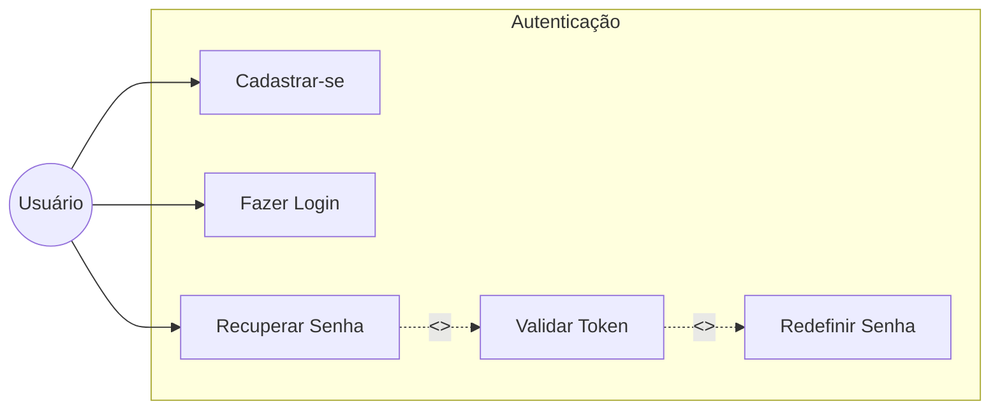

## 3.3 Diagrama de Casos de Uso - Módulo de Compras

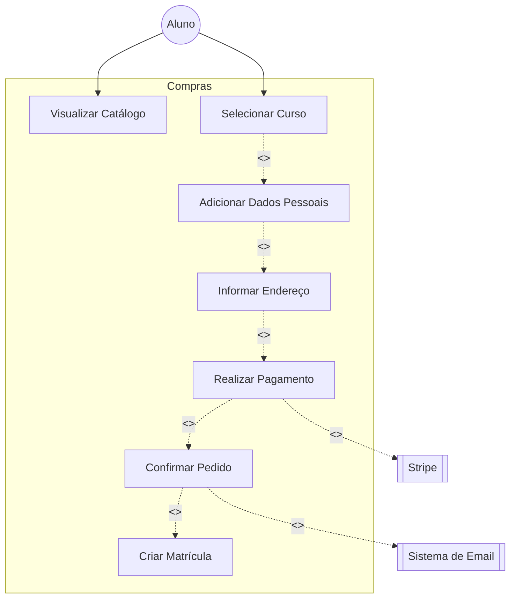

## 3.4 Casos de Uso Detalhados

### UC01 - Cadastrar-se

| Campo | Descrição |
|-------|-----------|
| **Nome** | Cadastrar-se |
| **Ator Principal** | Usuário não autenticado |
| **Pré-condições** | Usuário não possui conta no sistema |
| **Pós-condições** | Conta criada e usuário logado automaticamente |
| **Fluxo Principal** | 1. Usuário acessa página de cadastro 2. Sistema exibe formulário 3. Usuário preenche nome, email e senha 4. Sistema valida dados e força da senha 5. Sistema cria conta com expiração de 1 ano 6. Sistema realiza login automático 7. Sistema redireciona para cursos |
| **Fluxo Alternativo** | 4a. Email já cadastrado → Sistema exibe erro 4b. Senha fraca → Sistema exibe requisitos |

### UC05 - Comprar Curso

| Campo | Descrição |
|-------|-----------|
| **Nome** | Comprar Curso |
| **Ator Principal** | Aluno |
| **Atores Secundários** | Stripe, Sistema de Email |
| **Pré-condições** | Curso disponível para venda |
| **Pós-condições** | Pagamento processado e matrícula criada |
| **Fluxo Principal** | 1. Aluno seleciona curso 2. Sistema exibe página de checkout 3. Aluno preenche dados pessoais (se não logado) 4. Aluno preenche endereço 5. Sistema cria sessão no Stripe 6. Aluno é redirecionado para Stripe Checkout 7. Aluno realiza pagamento 8. Stripe envia webhook de confirmação 9. Sistema atualiza status do pagamento 10. Sistema cria matrícula 11. Sistema envia email de confirmação |
| **Fluxo Alternativo** | 7a. Pagamento falha → Sistema registra falha 8a. Webhook não recebido → Pagamento fica pendente |

### UC06 - Assistir Aulas

| Campo | Descrição |
|-------|-----------|
| **Nome** | Assistir Aulas |
| **Ator Principal** | Aluno matriculado |
| **Atores Secundários** | Bunny Stream |
| **Pré-condições** | Aluno autenticado e matriculado no curso |
| **Pós-condições** | Progresso da aula registrado |
| **Fluxo Principal** | 1. Aluno acessa curso 2. Sistema verifica matrícula 3. Sistema exibe lista de módulos e aulas 4. Aluno seleciona aula 5. Sistema carrega vídeo do Bunny Stream 6. Aluno assiste aula 7. Aluno marca aula como concluída 8. Sistema registra progresso |
| **Fluxo Alternativo** | 2a. Sem matrícula → Sistema redireciona para compra 4a. Aula não publicada → Sistema oculta aula |

### UC08 - Gerar Certificado

| Campo | Descrição |
|-------|-----------|
| **Nome** | Gerar Certificado |
| **Ator Principal** | Aluno |
| **Pré-condições** | Aluno completou 100% das aulas do curso |
| **Pós-condições** | Certificado em PDF baixado |
| **Fluxo Principal** | 1. Aluno acessa área de certificados 2. Sistema verifica progresso = 100% 3. Sistema gera certificado com dados do aluno e curso 4. Sistema converte para PDF (html2canvas + jsPDF) 5. Sistema inicia download do certificado |
| **Fluxo Alternativo** | 2a. Progresso < 100% → Sistema exibe progresso atual |

---

# 4. DIAGRAMAS DE ATIVIDADE

## 4.1 Diagrama de Atividade - Processo de Compra de Curso

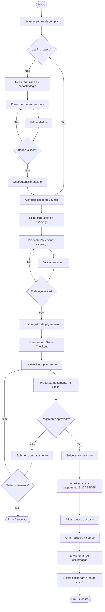

## 4.2 Diagrama de Atividade - Fluxo de Autenticação

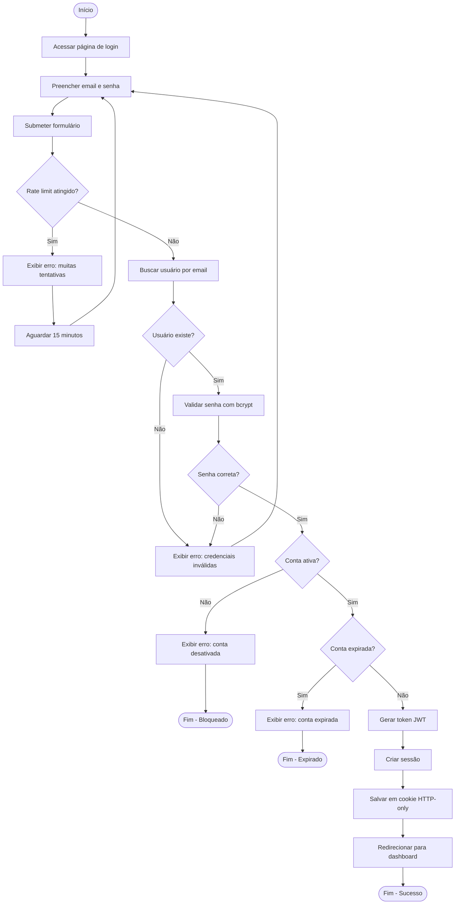

## 4.3 Diagrama de Atividade - Assistir Aula

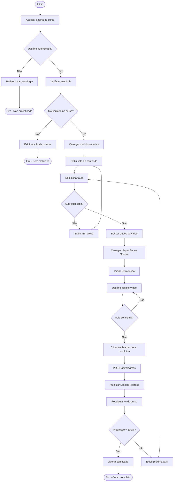

## 4.4 Diagrama de Atividade - Recuperação de Senha

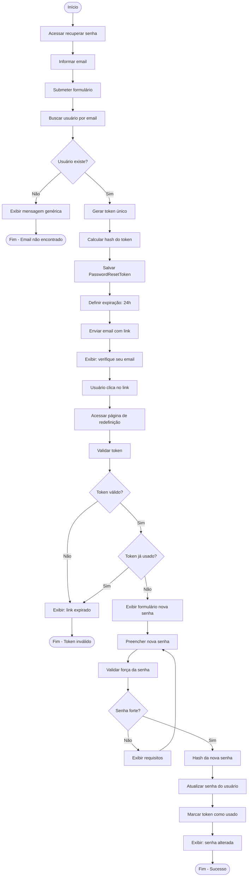

## 4.5 Diagrama de Atividade - Upload de Vídeo (Admin)

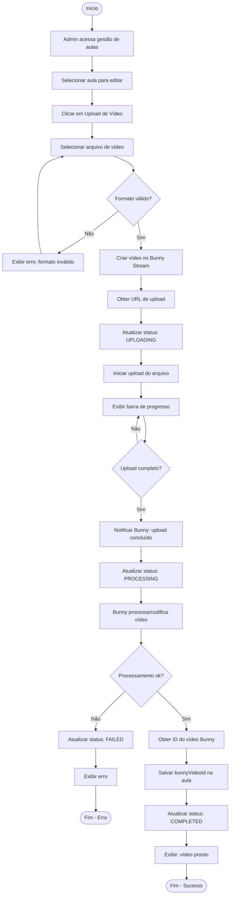

---

# 5. DIAGRAMAS DE ESTADOS

## 5.1 Diagrama de Estados - Pagamento

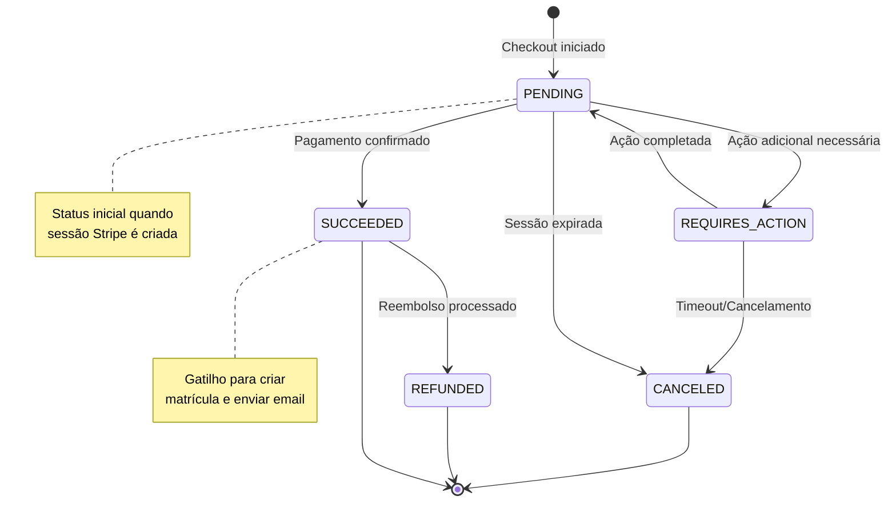

## 5.2 Diagrama de Estados - Pedido (Order Status)

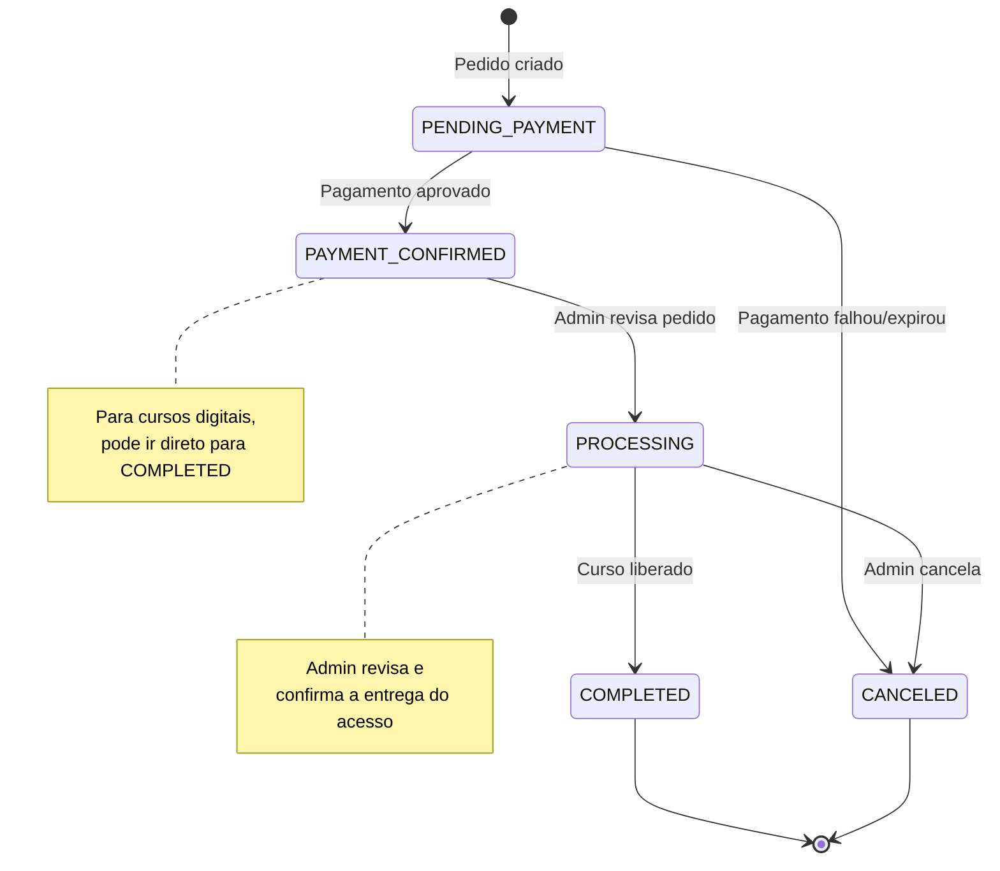

## 5.3 Diagrama de Estados - Envio de Produto Físico (Shipping)

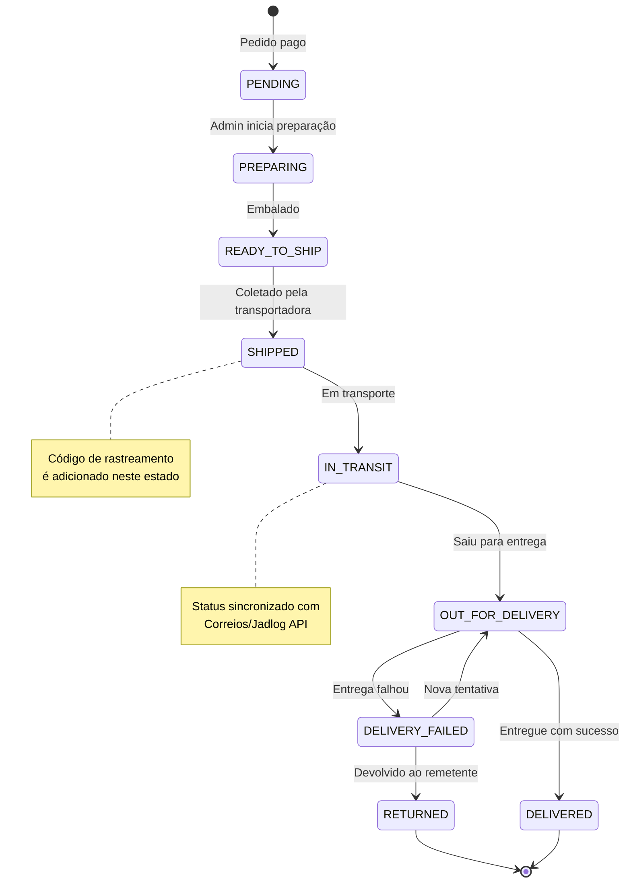

## 5.4 Diagrama de Estados - Conta de Usuário

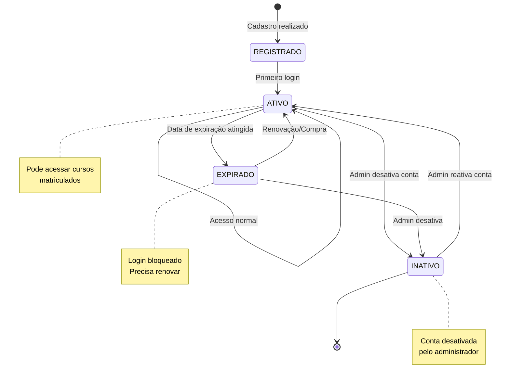

## 5.5 Diagrama de Estados - Aula (Lesson)

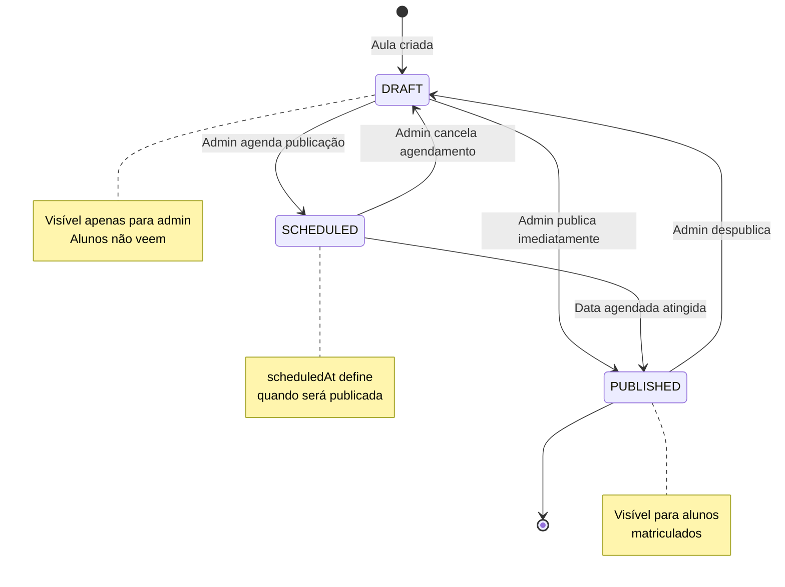

## 5.6 Diagrama de Estados - Upload de Vídeo

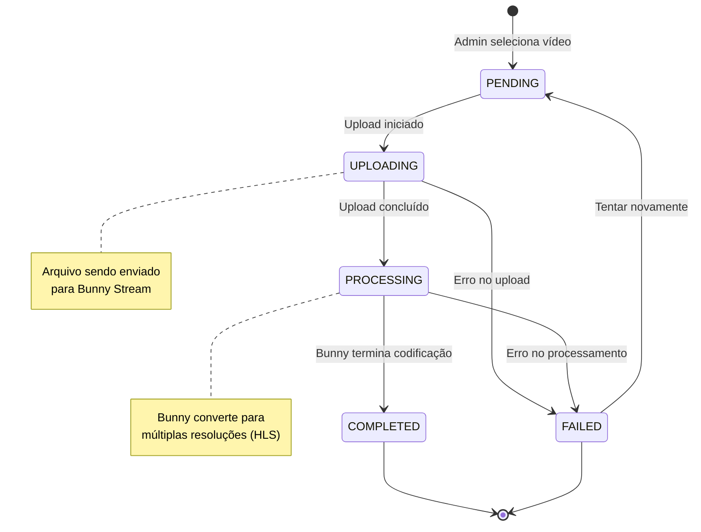

## 5.7 Diagrama de Estados - Matrícula (Enrollment)

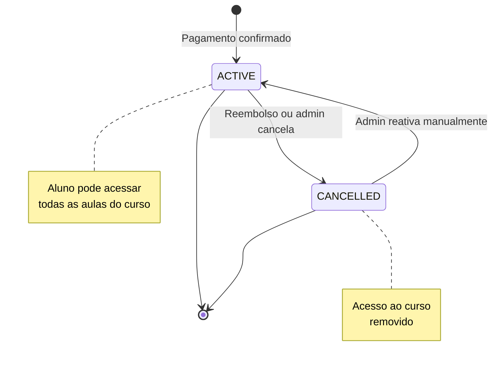

---

# 6. MODELO DE DADOS SIMPLIFICADO

## 6.1 Entidades Principais e Relacionamentos

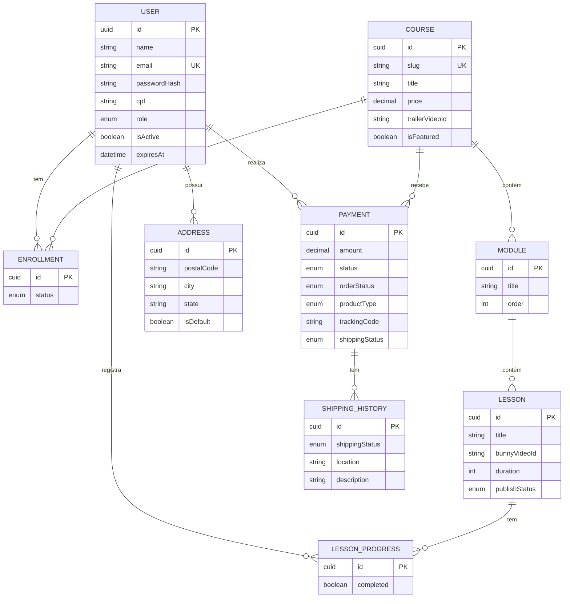

---

# 7. RESUMO PARA APRESENTAÇÃO

## 7.1 Pontos-Chave do Sistema

1. **Plataforma EAD** especializada em cursos de harmonização facial
2. **Arquitetura moderna** com Next.js 15, React 19 e TypeScript
3. **Pagamentos seguros** via Stripe com webhooks
4. **Streaming de vídeo** via Bunny Stream CDN
5. **Controle de acesso** baseado em roles (Aluno/Admin)
6. **Rastreamento de progresso** por aula e certificado automático
7. **Integração logística** com Correios e Jadlog para produtos físicos

## 7.2 Atores do Sistema

| Ator | Descrição |
|------|-----------|
| **Aluno** | Usuário que se cadastra, compra e acessa cursos |
| **Administrador** | Gerencia cursos, aulas, alunos e pedidos |
| **Stripe** | Sistema externo de processamento de pagamentos |
| **Bunny Stream** | Sistema externo de hospedagem de vídeos |
| **Correios/Jadlog** | Sistemas externos de rastreamento de entregas |
| **Resend** | Sistema externo de envio de emails |

## 7.3 Principais Fluxos

1. **Cadastro → Compra → Acesso** - Jornada do aluno
2. **Upload → Publicação → Consumo** - Ciclo de vida do conteúdo
3. **Pedido → Pagamento → Entrega** - Processo de vendas
4. **Progresso → Conclusão → Certificado** - Gamificação educacional

---

*Documentação gerada para apresentação acadêmica/profissional da Plataforma Taty*
